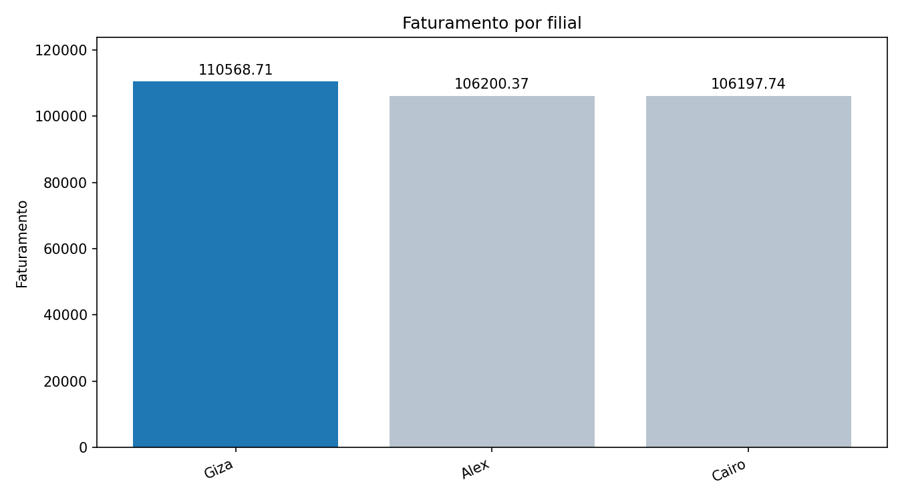
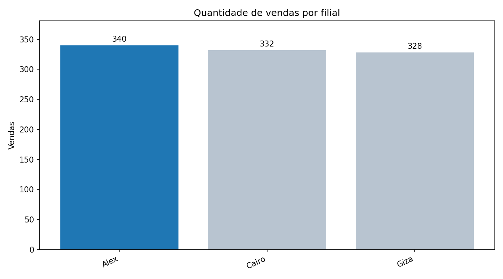
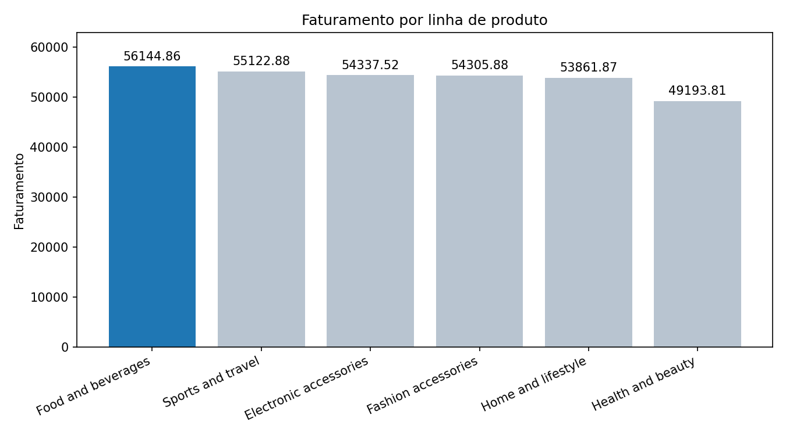
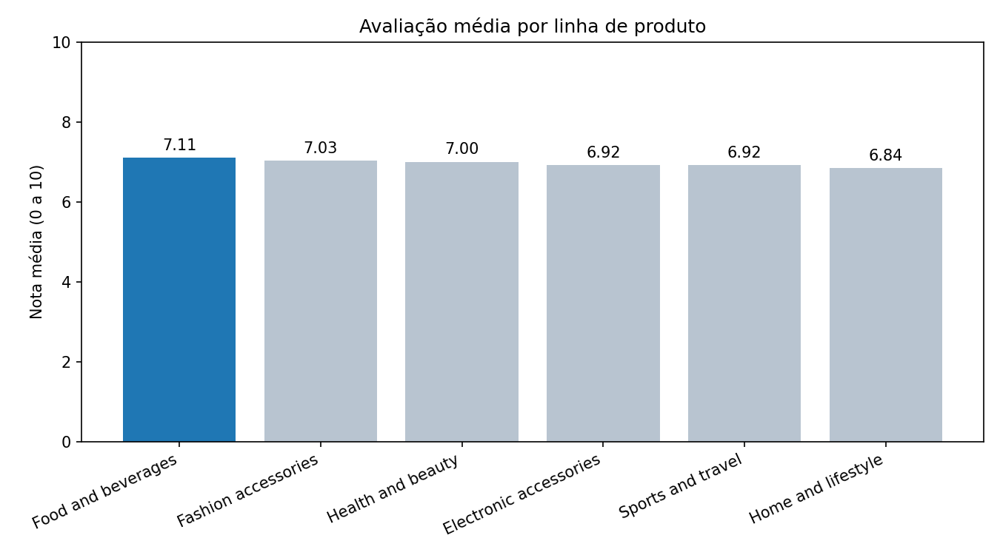
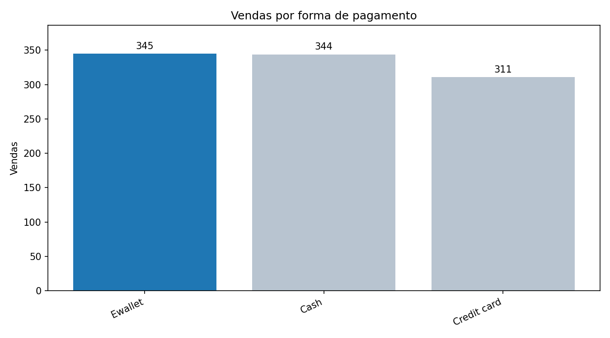
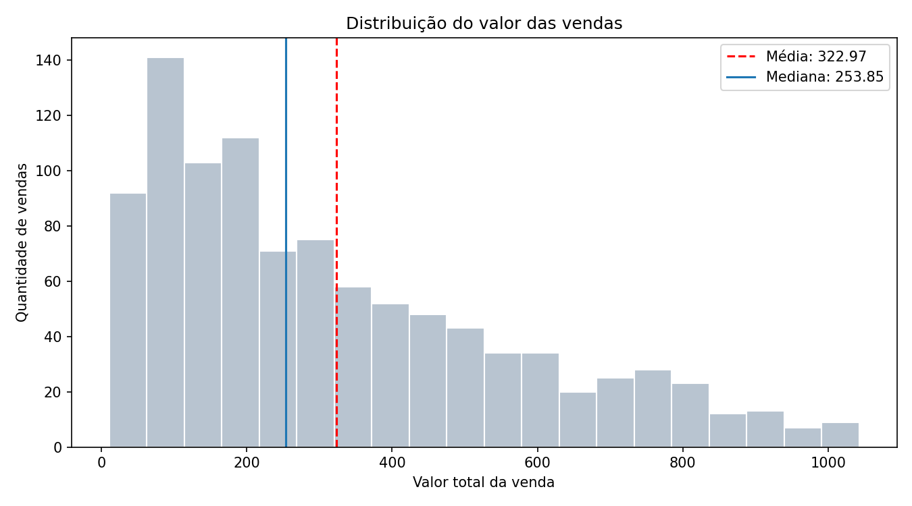
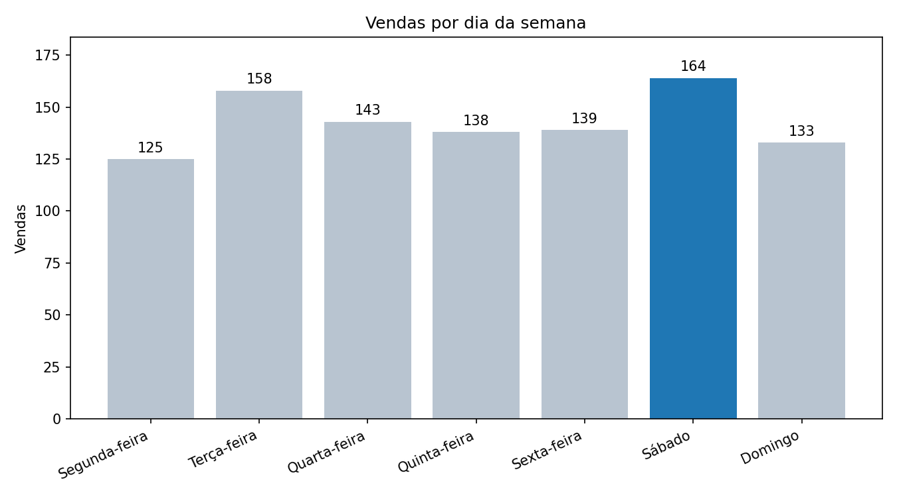

# Análise de Dados de Vendas de Supermercado

Projeto avaliativo do Módulo 1 do curso de Análise de Dados com Python.
O projeto constrói um pipeline completo: carrega as vendas brutas no
PostgreSQL, consulta e exporta dados com SQL, limpa e transforma com Pandas e
responde perguntas de negócio com estatística descritiva e gráficos.

**Fonte dos dados:**
[Supermarket Sales (Kaggle)](https://www.kaggle.com/datasets/faresashraf1001/supermarket-sales)
com 1000 vendas de 3 filiais e 17 colunas.

## Tecnologias

| Tecnologia | Uso no projeto |
|---|---|
| PostgreSQL e SQL (`psql`) | Banco de dados, camada Raw, consultas e exportação |
| Python 3 | Scripts de leitura, ETL e análise |
| Pandas | Leitura, limpeza, tipagem e estatística descritiva |
| Matplotlib | Gráficos |
| Git e GitHub | Controle de versão (branches e Conventional Commits) |
| VSCode | Ambiente de desenvolvimento |

## Arquitetura do pipeline

Estrutura inspirada na Arquitetura Medallion:

```
CSV (Kaggle) -> PostgreSQL (raw_vendas) -> consultas SQL e exportação
             -> Pandas (ETL) -> CSV tratado -> estatística e gráficos
```

| Camada | O que é | Onde fica |
|---|---|---|
| Raw (bruta) | Cópia fiel do CSV, com todas as colunas como texto | Tabela `raw_vendas` e `data/raw/` |
| Tratada | Dados limpos, tipados e com colunas derivadas | `data/processed/vendas_tratadas.csv` |
| Resultados | Respostas de negócio, estatísticas e gráficos | `resultados/` |

## Estrutura do repositório

```
├── sql/
│   ├── 01_criar_banco.sql      # cria o banco "supermercado"
│   ├── 02_criar_tabelas.sql    # tabelas raw_vendas e vendas_tratadas
│   ├── 02b_carga_raw.sql       # carga do CSV na camada Raw
│   └── 03_consultas.sql        # consultas de negócio e exportação para CSV
├── src/
│   ├── 01_leitura_dados.py     # leitura e inspeção inicial
│   ├── 02_etl_vendas.py        # limpeza, tipagem e colunas derivadas
│   └── 03_estatistica.py       # estatística, respostas e gráficos
├── data/
│   ├── raw/                    # CSV original e CSV exportado do banco
│   └── processed/              # base tratada e dicionário de dados
├── resultados/                 # gráficos (PNG) e tabelas (CSV)
├── requirements.txt
└── README.md
```

## Como executar

Os comandos abaixo são para Windows (PowerShell) e devem ser executados
**na raiz do projeto**.

**Pré-requisitos:** Python 3, PostgreSQL (com o `psql` no PATH) e Git.

### 1. Clonar e preparar o ambiente Python

```powershell
git clone https://github.com/williammmoura/Projeto_WilliamMoura_Analise_de_dados_TI.git
cd Projeto_WilliamMoura_Analise_de_dados_TI
python -m venv .venv
.venv\Scripts\Activate.ps1
pip install -r requirements.txt
```

### 2. Banco de dados

O `psql` pede a senha do usuário `postgres` a cada comando. Nenhuma credencial
é guardada no repositório.

```powershell
psql -U postgres -f sql/01_criar_banco.sql
psql -U postgres -d supermercado -f sql/02_criar_tabelas.sql
psql -U postgres -d supermercado -f sql/02b_carga_raw.sql
psql -U postgres -d supermercado -f sql/03_consultas.sql
```

O último comando mostra as consultas e regrava `data/raw/vendas_exportadas.csv`
e `resultados/sql_faturamento_por_filial.csv`.

### 3. Pipeline em Python

```powershell
python src/01_leitura_dados.py
python src/02_etl_vendas.py
python src/03_estatistica.py
```

## Modelagem e regras de integridade

- **`raw_vendas`:** 17 colunas `TEXT`, mesma ordem do CSV, para guardar os dados
  exatamente como vieram.
- **`vendas_tratadas`:** define o esquema e as regras da camada Tratada, com os
  tipos corretos (`VARCHAR`, `NUMERIC`, `INTEGER`, `DATE`, `TIME`), chave primária
  em `id_venda`, `NOT NULL` em filial, cidade, linha de produto e forma de
  pagamento, e `CHECK` para preço, imposto, valor total, custo e receita maiores
  ou iguais a zero, quantidade maior que zero e avaliação entre 0 e 10.
  Os dados tratados são salvos em CSV (`data/processed/`).
- Os nomes de colunas do banco são em minúsculas e sem acento.
- O dicionário completo das 22 colunas finais está em
  [`data/processed/dicionario_dados.md`](data/processed/dicionario_dados.md).

## Tratamento dos dados (ETL)

O script `src/02_etl_vendas.py` executa, nesta ordem:

1. Renomeia as colunas para o padrão do dicionário de dados.
2. Remove espaços extras dos textos.
3. Converte tipos: data (mês/dia/ano para data), hora (12 horas com AM/PM para
   24 horas) e números (arredondados para 2 casas). Valores inválidos viram nulos.
4. Trata ausentes: preenche os textos opcionais com "Não informado" e remove
   linhas sem campos obrigatórios.
5. Remove duplicatas (linhas repetidas e IDs de venda repetidos).
6. Aplica as mesmas regras `CHECK` do banco.
7. Cria 5 colunas derivadas: `mes`, `dia_semana`, `hora`, `faixa_valor`
   (quartis do valor total) e `total_confere` (confere se o valor total é igual a
   preço x quantidade + imposto, com tolerância de 0,02).

Resultado: 1000 linhas lidas, nenhum ausente, nenhuma duplicata, nenhuma violação
de regra, e 1000 linhas e 22 colunas na base tratada.

## Resultados

Cada pergunta foi respondida com uma hipótese formulada antes da análise.

| # | Pergunta | Hipótese | Resposta | Hipótese |
|---|---|---|---|---|
| 1 | Filial com maior faturamento | A filial com mais vendas também fatura mais | **Giza**: 110568.71 (ticket médio 337.10) | Refutada: Alex vende mais, mas Giza tem ticket médio maior |
| 2 | Filial com maior quantidade de vendas | A diferença entre as filiais é pequena (menos de 10%) | **Alex**: 340 vendas (3,7% acima da menor filial) | Confirmada |
| 3 | Linha de produto com maior faturamento | A linha mais vendida também fatura mais | **Food and beverages**: 56144.86 | Refutada: a mais vendida em número é Fashion accessories |
| 4 | Linha com melhor avaliação média | A linha de maior faturamento tem a melhor nota | **Food and beverages**: 7.11 | Confirmada (a menor é Home and lifestyle, com 6.84) |
| 5 | Forma de pagamento mais usada | Dinheiro (Cash) é a mais usada | **Ewallet**: 345 vendas (34,5%) | Refutada, mas por uma venda (Cash tem 344) |
| 6 | Valor médio das vendas | A média é puxada para cima por poucas vendas muito altas | **322.97** (mediana 253.85, desvio padrão 245.89) | Confirmada (assimetria de 0,89) |
| 7 | Maior venda registrada | Ocorreu na filial de maior faturamento | **1042.65**, fatura 860-79-0874, filial Giza | Confirmada |
| 8 | Dia da semana com mais vendas | É sábado ou domingo | **Sábado**: 164 vendas | Confirmada (domingo: 133) |

As respostas também estão em `resultados/respostas_negocio.csv` e as estatísticas
descritivas em `resultados/estatisticas_descritivas.csv`.

### Gráficos









### Observações sobre os dados

- A base não tem valores ausentes, duplicados ou fora das regras de negócio.
- Cada filial corresponde a uma única cidade (Alex/Yangon, Cairo/Mandalay,
  Giza/Naypyitaw).
- `margem_percentual` vale 4,76 em todas as linhas, e `receita_bruta` é igual a
  `imposto` em todas as linhas.
- As notas médias das linhas de produto são muito próximas (de 6,84 a 7,11), e
  Ewallet e Cash ficaram quase empatados. Essas diferenças pequenas devem ser
  interpretadas com cautela.
- Os totais do SQL e do Pandas podem diferir em centavos (por exemplo, 56144.84 e
  56144.86 na pergunta 3). O SQL soma os valores originais com 4 casas decimais e
  o Pandas soma valores já arredondados para 2 casas. Os vencedores são os mesmos.

## Boas práticas adotadas

- Branches por etapa e mensagens de commit no padrão Conventional Commits.
- Código em Python organizado em funções, seguindo o PEP-8.
- Credenciais fora do repositório e `.gitignore` configurado.

## Autor

William Moura